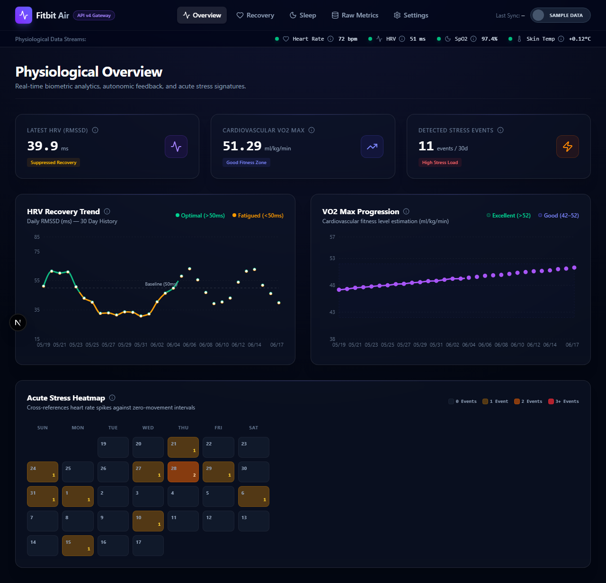

# 🫀 Fitbit Air Dashboard

> A personal health analytics dashboard that connects to the **Google Health API v4** to display live biometric data from your Fitbit or Pixel Watch — including heart rate, SpO₂, HRV, skin temperature, sleep stages, and more.



---

## ✨ Features

- **📊 Live Biometrics** — Real-time heart rate, SpO₂, HRV, and skin temperature pulled directly from Google Health
- **😴 Sleep Analytics** — Nightly sleep duration with light, deep, REM, and awake stage breakdowns
- **🏃 Activity Tracking** — Step count and daily activity summaries
- **🩺 Recovery Score** — Computed from HRV, resting HR, and sleep quality
- **📋 Raw Metrics Page** — Full tabular view of every data point, mirroring the Google Health app
- **🔄 Manual Refresh** — Fetch the latest data from Google on demand
- **🎨 Modern UI** — Dark glassmorphism design with smooth animations

---

## 🏗️ Architecture

```
Fitbit_Air_dashboard/
├── google-health-service/    # Python FastAPI backend
│   ├── main.py               # REST API endpoints
│   ├── extractor.py          # Google Health API v4 data fetchers
│   ├── derived_metrics.py    # Recovery score & analytics calculations
│   └── auth.py               # OAuth 2.0 flow handler
│
└── health-dashboard/         # Next.js 16 frontend
    ├── app/
    │   ├── page.tsx           # Main dashboard
    │   ├── raw/               # Raw metrics page
    │   ├── sleep/             # Sleep analytics page
    │   └── recovery/          # Recovery page
    ├── components/            # Reusable UI components
    └── lib/store.ts           # Zustand global state
```

**Stack:**
| Layer | Technology |
|---|---|
| Frontend | Next.js 16 · React 19 · TypeScript · Tailwind CSS |
| Charts | Recharts |
| State | Zustand |
| Backend | Python · FastAPI · Uvicorn |
| Auth | Google OAuth 2.0 (Desktop flow) |
| Data Source | Google Health API v4 (`health.googleapis.com/v4`) |

---

## 🚀 Getting Started

### Prerequisites

- **Python 3.11+** and **Node.js 18+**
- A **Google Cloud Project** with the [Google Health API](https://developers.google.com/health) enabled
- A **Fitbit** or **Pixel Watch** synced through **Google Health Connect** (Android) or the **Fitbit** app

> [!IMPORTANT]
> The Google Health API v4 is a restricted API. Your GCP project may need to be allowlisted by Google. Visit [developers.google.com/health](https://developers.google.com/health) to request access if the API isn't visible in your GCP library.

---

### 1. Google Cloud Setup

1. Go to [console.cloud.google.com](https://console.cloud.google.com) → Create a new project
2. Navigate to **APIs & Services → Library** → Search for **"Google Health API"** → **Enable**
3. Go to **APIs & Services → OAuth consent screen**:
   - Choose **External** → fill in app name & contact email
   - Add these three scopes manually:
     - `https://www.googleapis.com/auth/googlehealth.health_metrics_and_measurements.readonly`
     - `https://www.googleapis.com/auth/googlehealth.sleep.readonly`
     - `https://www.googleapis.com/auth/googlehealth.activity_and_fitness.readonly`
   - Under **Test Users**, add your own Gmail address
   - Keep the app status as **Testing** (not Published)
4. Go to **Credentials → + Create Credentials → OAuth client ID**
   - Application type: **Desktop app**
   - Click **Create** → **Download JSON** → save as `credentials.json`

---

### 2. One-Click Startup (Recommended for Windows)

For an automated setup and startup experience, simply do the following:

1. Place the downloaded `credentials.json` inside the **`google-health-service/`** directory.
2. Double-click the **`start_dashboard.bat`** script at the root of the project workspace.
   * This script will automatically create the Python virtual environment, install dependencies for both the backend and frontend, launch both servers, and open `http://localhost:3000` in your web browser.

---

### 3. Manual Developer Startup (Alternative)

If you prefer to start the servers manually in separate terminal windows, follow these steps:

#### Step A: Backend Setup

```bash
cd google-health-service

# Create and activate virtual environment
python -m venv venv

# On Windows:
.\venv\Scripts\Activate.ps1
# On macOS/Linux:
source venv/bin/activate

# Install dependencies
pip install -r requirements.txt

# Place credentials.json here (downloaded from GCP Console)
# then start the server
uvicorn main:app --reload --port 8000
```

On first launch, a **browser window** will open asking you to sign in with Google and grant health permissions. Once complete, a `token.json` file is saved — future launches skip this step.

You'll see this when the backend is ready:
```
INFO:     Uvicorn running on http://0.0.0.0:8000
INFO:     Application startup complete.
```

---

#### Step B: Frontend Setup

Open a **second terminal**:

```bash
cd health-dashboard

npm install
npm run dev
```

Then visit **[http://localhost:3000](http://localhost:3000)**

---

### 4. Viewing Live Data

The dashboard loads with **sample data** by default. To see your real health data:

1. Ensure the Python backend is running on port 8000
2. Open the dashboard at `http://localhost:3000`
3. Click the **⚙ Settings** icon (top-right)
4. Toggle from **Sample Data** → **Live Data**

---

## 📱 Pages

| Page | URL | Description |
|---|---|---|
| Dashboard | `/` | Main overview with metric cards and charts |
| Raw Metrics | `/raw` | Full tabular view of all raw API data points |
| Sleep | `/sleep` | Detailed sleep stage breakdown |
| Recovery | `/recovery` | Computed recovery score and trends |

---

## 🔐 Secret Files (never committed to Git)

These files are in `.gitignore` and are **never** pushed to GitHub:

| File | Contents |
|---|---|
| `google-health-service/credentials.json` | Your GCP OAuth client secret |
| `google-health-service/token.json` | Your personal Google access token |
| `google-health-service/.env` | Personal baselines (resting HR, etc.) |
| `health-dashboard/.env.local` | Frontend environment variables |

---

## 🛠️ Troubleshooting

| Problem | Solution |
|---|---|
| `credentials.json not found` | Make sure you placed the file in `google-health-service/` |
| `Google hasn't verified this app` | Click **Advanced → Go to app (unsafe)** — expected for dev apps |
| `403 Forbidden` on API calls | Add your Gmail to **Test Users** in GCP OAuth consent screen |
| `404 Not Found` for skin temp | Your device may not support sleep temperature deviation data |
| No data returned | Ensure your device has synced recently via Health Connect or Fitbit app |
| Backend offline badge | Start `uvicorn main:app --reload --port 8000` in a terminal first |
| `token.json` auth errors | Delete `token.json` and restart the backend to re-authenticate |
| PowerShell script blocked | Run: `Set-ExecutionPolicy -ExecutionPolicy RemoteSigned -Scope CurrentUser` |

---

## 💰 API Costs

**The Google Health API v4 is free to use for personal projects.** There is no per-request billing for accessing consumer wearable data. The API enforces generous rate limits (300 requests/minute per user), which this dashboard operates well within.

---

## 📄 License

This project is open source. Feel free to fork, modify, and share.

---

*Built with ❤️ using the Google Health API v4, Next.js, and FastAPI.*
